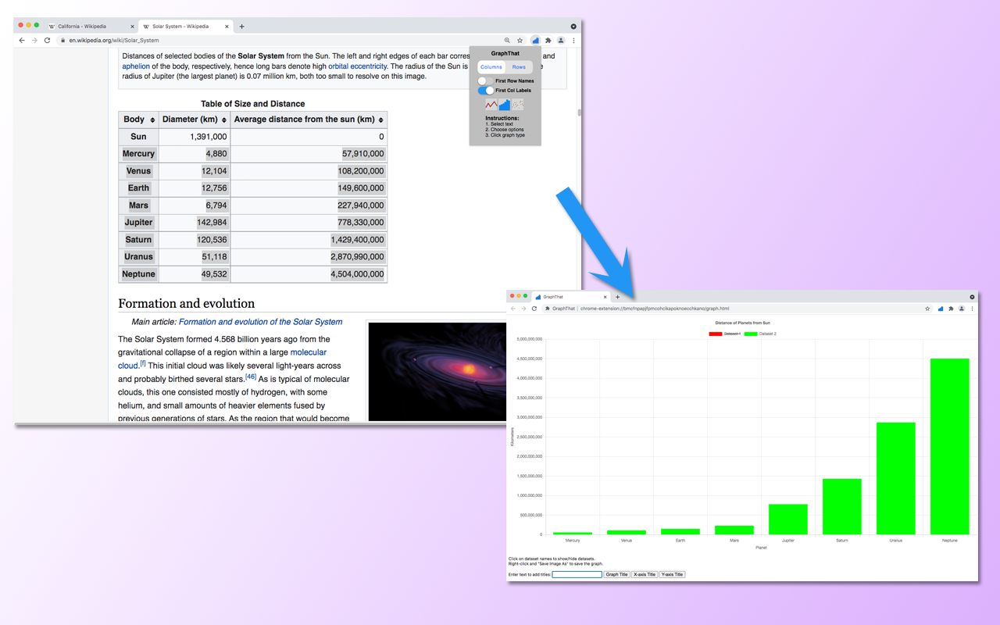

# GraphThat
A Google Chrome extension for quick graphing of selected text.

GraphThat allows the user to generate graphs from numerical data found on the web quickly and easily. Simply select the text and graph! It supports datasets in columns or rows, and graphs scatter plots, line charts, and bar charts.  

[GraphThat is available on the Chrome Web Store.](https://chrome.google.com/webstore/detail/graphthat/bejohmjjfdmohghahhpfnlchkihoieel?hl=en)  
[See the Intro/Demo on Youtube.](https://www.youtube.com/watch?v=VtkSDynuFxA)

**Sample:**  

**How to Use:**
1. Select the numerical data on the webpage that you would like to graph. 
2. Click on the extension icon in the toolbar.
3. In the popup choose the options:
    a. Is the data in columns (default) or rows?
    b. Is the first row (or col) the names of datasets?
    c. Is the first col (or row) the x-axis labels for the datasets?
4. Click on the icon for the type of graph desired. If valid data was selected, a new window will open with the desired graph. 
5. Hide or show datasets by clicking on their name in the legend.
6. Add titles for graph and axes by entering text in the box and clicking the appropriate button to add the title.
7. Optionally save the graph as a PNG file by right-clicking on the graph and selecting "Save Image As...".

**Installation:**  
Users please install GraphThat through the Chrome Web Store.  
GraphThat v0.1.0.0 has been tested on Chrome Version 97.0.4692.71

For development purposes only, the unpacked extension may be used in Chrome in "Developer Mode". Download the files in the repository and place them in a single folder. Select "Load unpacked" on the Chrome extensions management page. Select the folder just created. The extension should now be available.

**License:**  
GraphThat is Copyright 2022 Marshall Bullis.  
GraphThat uses Chart.js v3.6.2 provided under the MIT License.  
https://www.chartjs.org